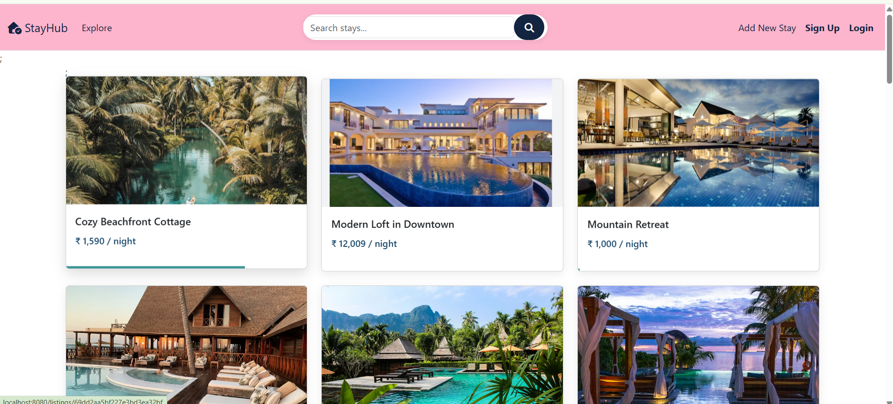
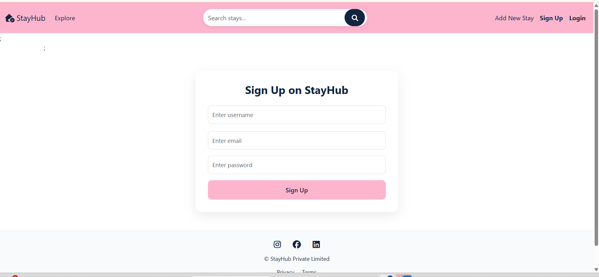
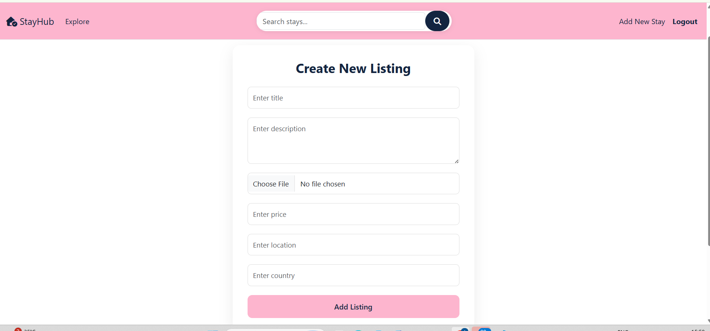
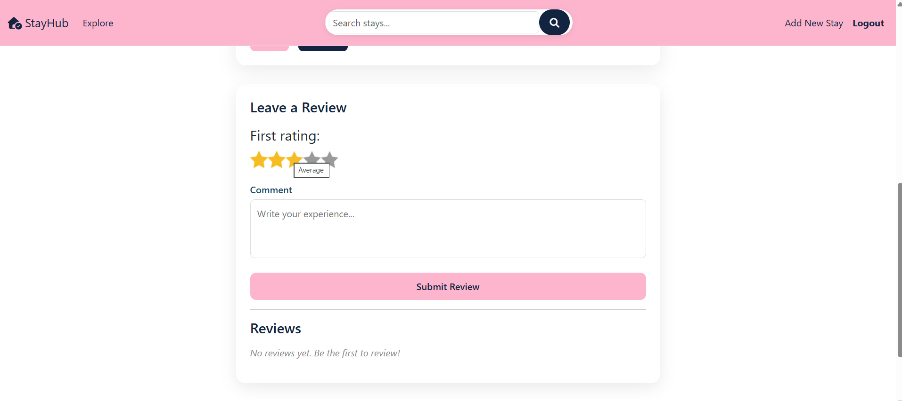

## StayHub – Airbnb-like Full Stack Web App

StayHub is a full-stack web application inspired by Airbnb that allows users to explore, create, review, and manage property listings.
It includes authentication, authorization, image uploads, and smart features like search and reviews.

## 🌐 Features

🔐 Authentication & Authorization
- User signup & login (Passport.js)
- Session-based authentication
- Only owners can edit/delete listings
- Review authorization implemented

Listings
- Create, edit, and delete listings
- Upload images via Cloudinary
- View detailed listing pages

 Reviews System
- Add reviews with star ratings ⭐
- Delete reviews (authorized users only)
- Dynamic review display

 Search Functionality
- Search listings by:
- Title
- Location
- Country
- Case-insensitive search using MongoDB regex
  
 UI/UX
- Clean Airbnb-inspired design
- Responsive layout
- Custom color palette
- Elegant forms & cards

## 📸 Screenshots

### Home Page


### Sign Up


### Create Listing


### Reviews



## Tech Stack

Frontend
- HTML, CSS, JavaScript
- Bootstrap
- EJS
  
Backend
- Node.js
- Express.js
  
Database
- MongoDB
- Mongoose
  
Authentication
- Passport.js
- express-session
  
Cloud
- Cloudinary

## Project Structure (MVC)
```
StayHub/
│
├── models/
├── routes/
├── controllers/
├── views/
├── public/
├── utils/
├── middleware.js
└── app.js
```
## ⚙️ Installation & Setup

1️⃣ Clone the repository
```
git clone https://github.com/your-username/stayhub.git
cd stayhub
```
2️⃣ Install dependencies
```
npm install
```

3️⃣ Setup environment variables

Create a .env file:
```
CLOUDINARY_CLOUD_NAME=your_cloud_name
CLOUDINARY_KEY=your_key
CLOUDINARY_SECRET=your_secret
```
4️⃣ Run the app
```
nodemon app.js
```

## Future Enhancements
-  AI-based review summarization
- Recommendation system
- Map integration (Leaflet / OpenStreetMap)
- Wishlist feature
- Filters (price, rating, location)

## Author

Ambika Soni
IIT Bombay – Aerospace Engineering
Aspiring Software Developer | ML Enthusiast
